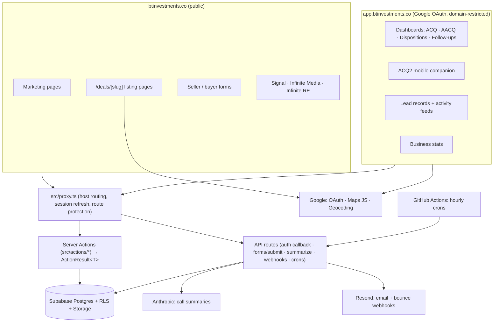

# Architecture

How the pieces of the BT Investments platform fit together. Written for
audit 001 (the checklist asks for the system on paper); the deeper design
history lives in `docs/superpowers/specs/`.

## One codebase, two faces

A single Next.js 16 App Router application serves both:

- **btinvestments.co** — the public marketing site: homepage, seller and
  buyer funnels, deal listing pages, and the sub-brand mini-sites
  (Signal, Infinite Media, Infinite RE, Hello).
- **app.btinvestments.co** — the internal app behind Google OAuth,
  restricted to `@btinvestments.co` accounts.

`src/proxy.ts` routes by host: on the app subdomain the URL bar drops the
`/app` prefix and the proxy rewrites internally. It also refreshes
sessions and protects internal routes. **Any new cron or webhook endpoint
must be added to its allowlist or it 307s to login** (this has bitten
twice; the file documents it).

## Data flow rules

- **All internal CRUD goes through Server Actions** (`src/actions/`),
  which return `ActionResult<T>` and enforce auth via `requireAuth()` /
  `requireAdmin()`. REST-style API routes exist only where an external
  party calls in (OAuth callback, public form posts, webhooks, crons) or
  where streaming/long work is involved (summarize, scrape).
- **RLS is on for every table** as defense in depth; the service-role
  client (`src/lib/supabase/admin.ts`) is server-only. Note from the
  geocode_cache incident: the service role bypasses RLS but NOT table
  grants — new tables need explicit GRANTs.
- **Validation is shared**: Zod schemas in `src/lib/validations/` are the
  contract between client and server (see API-CONTRACTS.md).
- **Call summaries cannot write BT's pricing fields**: `/api/summarize`
  strips `#range` and `#our_current_offer` before the note is saved
  (v8.1.0). Only Randy sets those two fields.

## Client-facing static pages

Three URL families are served as hand-authored static HTML from `public/`,
rewritten in `next.config.ts` to hide the `.html` extension:

| URL | Files | Purpose |
|---|---|---|
| `/proposals/<slug>` | `public/proposals/` | Client proposals |
| `/proofs/<slug>` | `public/proofs/` | Design work sent for review |
| `/shoot-briefs/<slug>` | `public/shoot-briefs/` | Infinite Media shoot briefs |

They are deliberately NOT React routes. Each document must stay byte-identical
to the version that was signed off, and a static file cannot drift when
unrelated app code changes. Publishing is a file drop, never a code change, and
an unknown slug 404s cleanly because the rewrite target does not exist.

All three carry `robots: noindex, nofollow` - they are private client links
reached directly, not public pages. They need no entry in `src/proxy.ts`
because they fall through its default-allow branch on the apex host.

The shoot-brief format is locked; see `docs/SHOOT-BRIEF-TEMPLATE.md`.

## Scheduling

Vercel Hobby allows daily crons only, so hourly jobs run from GitHub
Actions hitting API endpoints. The Nightly Follow Up Sweep stamps
`last_follow_up_sweep_at`; a watchdog flags staleness past 36 hours.

## External services

| Service | Used for | Notes |
| --- | --- | --- |
| Supabase | Postgres, auth, storage | RLS everywhere; migrations in `supabase/migrations/` |
| Google OAuth | Login | Domain-restricted to btinvestments.co |
| Google Maps JS + Geocoding | Interactive maps | Billing live since 8/13; public pages geocode server-side through the permanent `geocode_cache` table |
| Anthropic | Call summaries | Pricing-field guard in the summarize route |
| Resend | Outbound email, bounce webhooks | Permanent bounces become red feed entries |
| Vercel | Hosting | Production project `bt-investments-app` |
